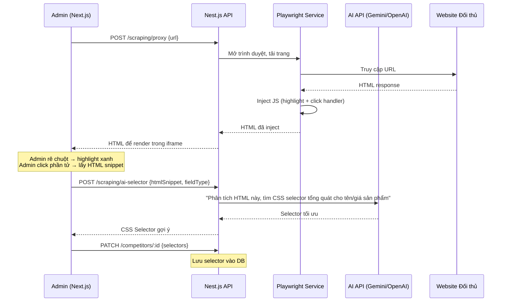

# Kế hoạch Triển khai Dự án AutoAP24h FullStack

## Mục tiêu

Xây dựng hệ thống quản lý & đối chiếu giá sản phẩm tự động giữa AP24h và các đối thủ cạnh tranh (CellphoneS, FPT, Hoàng Hà...), sử dụng kiến trúc **Fullstack Next.js (Frontend) + Nest.js (Backend)** với TypeScript. Hệ thống hỗ trợ cào dữ liệu tự động, so khớp sản phẩm, duyệt giá, và tự động cập nhật giá lên trang quản trị AP24h qua Playwright.

> [!IMPORTANT]
> Dự án này vừa là **công cụ thực tế** giải quyết bài toán kinh doanh, vừa là **bài tập thực hành** để nắm vững kiến trúc FullStack Next.js/Nest.js. Các công nghệ sẽ được cập nhật lên **phiên bản mới nhất** thay vì sử dụng các version cũ trong lesson 1 năm trước.

---

## 1. Stack Công nghệ

| Thành phần | Công nghệ | Ghi chú |
|---|---|---|
| **Frontend** | Next.js 15 (React 19, App Router) | TypeScript, TailwindCSS, Ant Design (antd) |
| **Backend** | Nest.js v11 | TypeScript, Module/Controller/Service pattern |
| **Database** | MongoDB (cài trực tiếp, không Docker) | Mongoose ODM, thiết kế theo NoSQL (embed) |
| **Auth Frontend** | Server Actions + Cookie | Lưu JWT Token vào httpOnly Cookie qua `next/headers` |
| **Auth Backend** | JWT + Passport | Bearer Token, ConfigService cho `.env` |
| **Email** | Nodemailer (inline HTML) | Gửi email OTP trực tiếp, không dùng Handlebars template |
| **Scraping** | Playwright + Cheerio | Cào dữ liệu nhanh + Auto-update giá ổn định |
| **Scheduling** | CronJob (cơ bản) | Cào dữ liệu 1 lần/ngày |
| **Date/Time** | dayjs | Thay thế cho moment |

---

## 2. Thiết kế Database (MongoDB - NoSQL)

> [!NOTE]
> Thiết kế theo triết lý MongoDB: **"Dữ liệu đọc cùng nhau thì lưu cùng nhau"** (Embed thay vì Reference khi có thể). Giảm thiểu việc tách bảng và `$lookup` (JOIN). Chỉ tách collection riêng khi mảng con có thể phình lên hàng ngàn phần tử hoặc cần truy vấn độc lập thường xuyên.

### 2.1. Collection `users` - Quản lý tài khoản nội bộ
```typescript
// User Schema
{
  _id: ObjectId,
  email: string,           // unique, nhận OTP xác thực
  phone: string,            // unique, đồng bộ với hệ thống công ty, dùng để đăng nhập
  password: string,         // bcrypt hashed
  isActive: boolean,        // default: false, kích hoạt qua OTP email
  codeId: string,           // mã OTP (UUID ngẫu nhiên)
  codeExpired: Date,        // thời hạn OTP (5 phút)
  createdAt: Date,          // tự sinh bởi Mongoose timestamps
  updatedAt: Date
}
```

### 2.2. Collection `categories` - Danh mục sản phẩm (Bảng tra cứu đơn giản)
```typescript
// Category Schema - Đơn giản, chỉ cần tên và trạng thái
{
  _id: ObjectId,
  name: string,              // "iPad", "iPhone", "Mac", "Phụ kiện"
  isActive: boolean,         // default: true
  createdAt: Date,
  updatedAt: Date
}
```

### 2.3. Collection `competitors` - Cấu hình website đối thủ (Nhúng scrapingUrls)
```typescript
// Competitor Schema - Nhúng (embed) danh sách link cào bên trong document
{
  _id: ObjectId,
  name: string,              // "CellphoneS", "FPT Shop"...
  domain: string,            // "cellphones.com.vn"
  logoUrl?: string,
  selectors: {               // CSS Selectors chung cho toàn bộ website đối thủ
    productContainer: string, // CSS selector khối sản phẩm: ".product-info"
    productName: string,      // CSS selector tên: ".product__name"
    productPrice: string,     // CSS selector giá: ".product__price--show"
    loadMoreButton?: string,  // CSS selector nút "Xem thêm" (nếu có)
    pagination?: string       // CSS selector phân trang (nếu có)
  },
  // ========== EMBED: Danh sách URL cào theo danh mục ==========
  // Thay vì tạo bảng riêng scraping_configs, nhúng trực tiếp vào đây
  // Lý do: 1 đối thủ chỉ có tối đa 10-20 link cào, không phình quá lớn
  scrapingUrls: [
    {
      categoryId: ObjectId,    // ref -> categories
      categoryName: string,    // Lưu luôn tên để hiển thị nhanh, tránh $lookup
      url: string,             // "https://cellphones.com.vn/ipad.html"
      isActive: boolean,
      lastScrapedAt?: Date
    }
  ],
  isActive: boolean,
  createdAt: Date,
  updatedAt: Date
}
```

### 2.4. Collection `products` - Sản phẩm AP24h (nguồn chính)
```typescript
// Product Schema
{
  _id: ObjectId,
  name: string,
  normalizedName: string,     // tên đã chuẩn hóa (loại bỏ từ rác) để so khớp
  categoryId: ObjectId,       // ref -> categories
  currentPrice: number,       // giá hiện tại trên AP24h
  ap24hAdminUrl?: string,     // link trang sửa sản phẩm trên admin AP24h
  isActive: boolean,
  createdAt: Date,
  updatedAt: Date
}
```

### 2.5. Collection `competitor_products` - Sản phẩm cào từ đối thủ
```typescript
// CompetitorProduct Schema
{
  _id: ObjectId,
  competitorId: ObjectId,     // ref -> competitors
  categoryId: ObjectId,       // ref -> categories
  name: string,
  normalizedName: string,
  price: number,
  scrapedAt: Date,            // thời điểm cào
  createdAt: Date,
  updatedAt: Date
}
```

### 2.6. Collection `product_matches` - Kết quả so khớp sản phẩm
```typescript
// ProductMatch Schema
{
  _id: ObjectId,
  productId: ObjectId,              // ref -> products (sản phẩm AP24h)
  competitorProductId: ObjectId,    // ref -> competitor_products
  matchScore: number,               // tỷ lệ khớp (0-1), threshold > 0.6
  ap24hPrice: number,
  competitorPrice: number,
  priceDifference: number,          // chênh lệch giá (VNĐ)
  priceDifferencePercent: number,   // chênh lệch giá (%)
  status: string,                   // "pending" | "approved" | "rejected" | "applied"
  approvedBy?: ObjectId,            // ref -> users
  approvedAt?: Date,
  appliedAt?: Date,                 // thời điểm đã cập nhật lên AP24h
  createdAt: Date,
  updatedAt: Date
}
```

### 2.7. Collection `price_histories` - Lịch sử thay đổi giá
```typescript
// PriceHistory Schema
{
  _id: ObjectId,
  productId: ObjectId,       // ref -> products
  oldPrice: number,
  newPrice: number,
  source: string,            // tên đối thủ (nguồn giá mới)
  changedBy: ObjectId,       // ref -> users (người duyệt)
  matchId: ObjectId,         // ref -> product_matches
  createdAt: Date
}
```

### 2.8. Collection `ignored_keywords` - Từ khóa loại trừ khi map
```typescript
// IgnoredKeyword Schema
{
  _id: ObjectId,
  keyword: string,           // "chính hãng", "apple", "2024", "wifi"...
  categoryId?: ObjectId,     // áp dụng cho danh mục cụ thể (null = tất cả)
  createdAt: Date
}
```

---

## 3. Kiến trúc Backend - Nest.js

### 3.1. Cấu trúc thư mục Backend
```
backend/
├── src/
│   ├── auth/                    # Module xác thực (JWT + Passport)
│   │   ├── auth.module.ts       # Đăng ký các service, strategy và cấu hình JWT
│   │   ├── auth.controller.ts   # Định nghĩa các endpoint (login, register, verify OTP)
│   │   ├── auth.service.ts      # Chứa logic nghiệp vụ xử lý đăng nhập, cấp token, gửi email
│   │   ├── dto/                 # Data Transfer Object (validate dữ liệu đầu vào)
│   │   │   ├── login.dto.ts     # Validate phone và password khi login
│   │   │   ├── register.dto.ts  # Validate thông tin khi tạo tài khoản
│   │   │   ├── verify.dto.ts    # Validate email và OTP khi xác thực
│   │   │   ├── forgot-password.dto.ts # Validate email khi quên mật khẩu
│   │   │   └── reset-password.dto.ts  # Validate email, OTP, newPassword khi đổi mật khẩu
│   │   ├── jwt.strategy.ts      # Logic giải mã và verify JWT token từ header request
│   │   └── jwt-auth.guard.ts    # Custom Guard bảo vệ các route yêu cầu đăng nhập
│   ├── users/                   # Module quản lý người dùng
│   │   ├── users.module.ts      # Khai báo module users
│   │   ├── users.controller.ts  # Endpoint CRUD nhân viên
│   │   ├── users.service.ts     # Thao tác với DB (tìm, thêm, sửa, xóa user)
│   │   ├── dto/
│   │   │   └── create-user.dto.ts # DTO dùng cho tạo user mới (dùng chung cho register)
│   │   └── schemas/
│   │       └── user.schema.ts   # Định nghĩa cấu trúc document MongoDB cho User (Mongoose)
│   ├── categories/              # Module quản lý danh mục sản phẩm
│   │   ├── categories.module.ts
│   │   ├── categories.controller.ts # API CRUD danh mục
│   │   ├── categories.service.ts
│   │   ├── dto/
│   │   └── schemas/
│   │       └── category.schema.ts
│   ├── competitors/             # Module quản lý đối thủ (bao gồm cả link cào nhúng bên trong)
│   │   ├── competitors.module.ts
│   │   ├── competitors.controller.ts # API CRUD đối thủ + quản lý scrapingUrls
│   │   ├── competitors.service.ts    # Logic lưu trữ thông tin & selector đối thủ
│   │   ├── dto/
│   │   └── schemas/
│   │       └── competitor.schema.ts  # Cấu trúc DB lưu đối thủ + CSS selectors + scrapingUrls (embed)
│   ├── products/                # Module quản lý sản phẩm gốc của AP24h
│   │   ├── products.module.ts
│   │   ├── products.controller.ts
│   │   ├── products.service.ts
│   │   ├── dto/
│   │   └── schemas/
│   │       └── product.schema.ts
│   ├── scraping/                # Module cào dữ liệu (Playwright + Cheerio + CronJob)
│   │   ├── scraping.module.ts
│   │   ├── scraping.controller.ts # Endpoint kích hoạt cào thủ công, proxy, gợi ý AI
│   │   ├── scraping.service.ts  # Logic Playwright (tải trang), Cheerio (bóc tách) và gọi AI
│   │   └── scraping.cron.ts     # Khai báo CronJob (vd: @Cron('0 0 * * *')) chạy tự động
│   ├── matching/                # Module xử lý thuật toán so khớp sản phẩm
│   │   ├── matching.module.ts
│   │   ├── matching.controller.ts # Endpoint duyệt (Approve)/từ chối (Reject) giá
│   │   ├── matching.service.ts  # Logic so khớp token, tính % giống nhau
│   │   ├── dto/
│   │   └── schemas/
│   │       └── product_match.schema.ts
│   ├── price-update/            # Module tự động cập nhật giá lên trang Admin AP24h
│   │   ├── price-update.module.ts
│   │   ├── price-update.controller.ts
│   │   └── price-update.service.ts # Logic dùng Playwright giả lập thao tác Admin
│   ├── price-history/           # Module lưu trữ và truy vấn lịch sử giá
│   │   ├── price-history.module.ts
│   │   ├── price-history.controller.ts
│   │   ├── price-history.service.ts
│   │   └── schemas/
│   │       └── price_history.schema.ts
│   ├── ignored-keywords/        # Module quản lý từ khóa rác (loại trừ khi map)
│   │   ├── ignored-keywords.module.ts
│   │   ├── ignored-keywords.controller.ts
│   │   ├── ignored-keywords.service.ts
│   │   ├── dto/
│   │   └── schemas/
│   │       └── ignored_keyword.schema.ts
│   ├── mail/                    # Module gửi email tự động (Nodemailer)
│   │   └── mail.service.ts      # Gửi email OTP trực tiếp bằng inline HTML (không dùng template .hbs)
│   ├── common/                  # Các utility dùng chung
│   │   └── filters/
│   │       └── http-exception.filter.ts # Global Exception Filter format JSON lỗi chuẩn
│   ├── app.module.ts            # Root module gom tất cả các module con, cấu hình Mongoose
│   └── main.ts                  # Điểm khởi chạy server, thiết lập ValidationPipe, ExceptionFilter, CORS
├── .env                         # Khai báo biến môi trường (PORT, MONGODB_URI, JWT_SECRET, MAIL_*)
├── nest-cli.json
├── package.json
└── tsconfig.json
```

### 3.2. Các Module Backend & API Endpoints

#### Auth Module (`/api/auth`)
| Method | Endpoint | Mô tả | Guard |
|---|---|---|---|
| POST | `/api/auth/register` | Đăng ký tài khoản + gửi OTP qua email | Public |
| POST | `/api/auth/login` | Đăng nhập bằng phone + password, trả về JWT access_token | Public |
| POST | `/api/auth/verify` | Kích hoạt tài khoản bằng OTP | Public |
| POST | `/api/auth/forgot-password` | Gửi OTP quên mật khẩu | Public |
| POST | `/api/auth/reset-password` | Đổi mật khẩu bằng OTP | Public |
| GET | `/api/auth/profile` | Xem thông tin user hiện tại (test guard) | JWT |

#### Users Module (`/users`)
| Method | Endpoint | Mô tả | Guard |
|---|---|---|---|
| GET | `/users` | Danh sách nhân viên | JWT |
| POST | `/users` | Thêm nhân viên mới | JWT |
| PATCH | `/users/:id` | Cập nhật thông tin | JWT |
| DELETE | `/users/:id` | Xóa nhân viên | JWT |

#### Categories Module (`/categories`)
| Method | Endpoint | Mô tả | Guard |
|---|---|---|---|
| GET | `/categories` | Danh sách danh mục | JWT |
| POST | `/categories` | Thêm danh mục mới | JWT |
| PATCH | `/categories/:id` | Cập nhật tên danh mục | JWT |
| DELETE | `/categories/:id` | Xóa danh mục | JWT |

#### Competitors Module (`/competitors`)
| Method | Endpoint | Mô tả | Guard |
|---|---|---|---|
| GET | `/competitors` | Danh sách đối thủ (kèm scrapingUrls) | JWT |
| GET | `/competitors/:id` | Chi tiết 1 đối thủ | JWT |
| POST | `/competitors` | Thêm đối thủ mới (kèm selectors + scrapingUrls) | JWT |
| PATCH | `/competitors/:id` | Cập nhật thông tin đối thủ | JWT |
| DELETE | `/competitors/:id` | Xóa đối thủ | JWT |

#### Scraping Module (`/scraping`)
| Method | Endpoint | Mô tả | Guard |
|---|---|---|---|
| POST | `/scraping/proxy` | Proxy tải trang web về (cho UI Point & Click) | JWT |
| POST | `/scraping/ai-selector` | Gọi AI phân tích HTML → trả CSS selector | JWT |
| POST | `/scraping/ai-keywords` | Gọi AI phân tích danh sách SP mẫu → gợi ý từ khóa rác | JWT |
| POST | `/scraping/run` | Chạy thủ công một lượt cào | JWT |
| GET | `/scraping/status` | Trạng thái CronJob | JWT |

#### Matching Module (`/matching`)
| Method | Endpoint | Mô tả | Guard |
|---|---|---|---|
| GET | `/matching` | Danh sách kết quả so khớp (bảng đối chiếu giá) | JWT |
| POST | `/matching/approve` | Duyệt (Approve) cập nhật giá | JWT |
| POST | `/matching/reject` | Từ chối cập nhật giá | JWT |
| POST | `/matching/apply` | Thực thi cập nhật giá lên AP24h (Playwright) | JWT |

#### Price History Module (`/price-history`)
| Method | Endpoint | Mô tả | Guard |
|---|---|---|---|
| GET | `/price-history` | Xem lịch sử thay đổi giá | JWT |
| GET | `/price-history/:productId` | Lịch sử theo sản phẩm | JWT |

#### Ignored Keywords Module (`/ignored-keywords`)
| Method | Endpoint | Mô tả | Guard |
|---|---|---|---|
| GET | `/ignored-keywords` | Danh sách từ khóa loại trừ | JWT |
| POST | `/ignored-keywords` | Thêm từ khóa | JWT |
| DELETE | `/ignored-keywords/:id` | Xóa từ khóa | JWT |

---

## 4. Kiến trúc Frontend - Next.js

### 4.1. Cấu trúc thư mục Frontend
```
frontend/
├── src/
│   ├── app/                           # Sử dụng Next.js App Router (Routing dựa trên thư mục)
│   │   ├── (auth)/                    # Route group cho Auth (không cần đăng nhập)
│   │   │   ├── login/
│   │   │   │   └── page.tsx           # Trang Đăng nhập (email + password)
│   │   │   ├── register/
│   │   │   │   └── page.tsx           # Trang Đăng ký tài khoản
│   │   │   ├── verify/
│   │   │   │   └── page.tsx           # Trang nhập mã OTP xác thực (nhận email qua URL query)
│   │   │   ├── forgot-password/
│   │   │   │   └── page.tsx           # Trang quên mật khẩu (nhập email)
│   │   │   └── reset-password/
│   │   │       └── page.tsx           # Trang đặt lại mật khẩu (nhập OTP + mật khẩu mới)
│   │   ├── (admin)/                   # Route group cho Admin (yêu cầu JWT)
│   │   │   ├── layout.tsx             # Layout chung: Sidebar (Menu) + Header (Avatar, Logout)
│   │   │   ├── dashboard/
│   │   │   │   └── page.tsx           # Trang tổng quan (thống kê số liệu)
│   │   │   ├── categories/
│   │   │   │   └── page.tsx           # Trang CRUD danh mục sản phẩm
│   │   │   ├── competitors/
│   │   │   │   ├── page.tsx           # Trang danh sách đối thủ cạnh tranh
│   │   │   │   └── [id]/
│   │   │   │       └── setup/
│   │   │   │           └── page.tsx   # ⭐ Trang Point & Click: Render web đối thủ qua Iframe để chọn selector
│   │   │   ├── price-comparison/
│   │   │   │   └── page.tsx           # Bảng so sánh & duyệt giá cập nhật
│   │   │   ├── ignored-keywords/
│   │   │   │   └── page.tsx           # Trang cấu hình danh sách từ khóa rác
│   │   │   ├── price-history/
│   │   │   │   └── page.tsx           # Trang xem biểu đồ và lịch sử thay đổi giá
│   │   │   └── users/
│   │   │       └── page.tsx           # Trang quản lý danh sách tài khoản nhân viên
│   │   ├── layout.tsx                 # Root layout: html, body, font chữ, theme Ant Design
│   │   └── page.tsx                   # Trang Root (/) - redirect vào /dashboard hoặc /login
│   ├── components/                    # Chứa tất cả các React Components
│   │   ├── ui/                        # Các component UI nhỏ dùng chung
│   │   ├── layout/                    # Các khối layout lớn (SidebarMenu.tsx, AdminHeader.tsx)
│   │   └── features/                  # Các component phức tạp gắn liền với một tính năng lớn
│   │       ├── SelectorPicker.tsx     # ⭐ Component chứa logic iframe, highlight element và postMessage
│   │       ├── PriceComparisonTable.tsx
│   │       └── PriceHistoryChart.tsx
│   ├── actions/                       # Next.js Server Actions (gọi API an toàn từ phía Server)
│   │   ├── auth.action.ts             # login, register, verify, forgotPassword, resetPassword
│   │   ├── category.action.ts         # CRUD danh mục
│   │   ├── competitor.action.ts       # CRUD đối thủ (kèm scrapingUrls)
│   │   ├── scraping.action.ts         # Cào dữ liệu, AI selector
│   │   └── admin.action.ts            # Thống kê, CRUD user
│   └── types/                         # Interface/type TypeScript thống nhất
│       ├── user.type.ts
│       ├── competitor.type.ts
│       ├── product.type.ts
│       └── scraping.type.ts
├── middleware.ts                       # Middleware chặn các route (admin) nếu chưa đăng nhập
├── .env                               # Biến môi trường (NEXT_PUBLIC_API_URL, NEXT_PUBLIC_USE_MOCK_DATA)
├── package.json
├── tailwind.config.ts
└── tsconfig.json
```

### 4.2. Danh sách Màn hình Frontend

#### Nhóm Auth (Không cần đăng nhập)
1. **Đăng nhập** (`/login`) - Form đăng nhập (phone + password), gọi API `/api/auth/login`, lưu JWT vào Cookie
2. **Đăng ký** (`/register`) - Form tạo tài khoản (name, phone, email, password), nhận OTP qua email
3. **Xác thực OTP** (`/verify`) - Form nhập mã OTP (nhận email từ URL query `?email=...`)
4. **Quên mật khẩu** (`/forgot-password`) - Form nhập email → gửi OTP → chuyển sang trang Reset
5. **Đặt lại mật khẩu** (`/reset-password`) - Form nhập OTP + mật khẩu mới (nhận email từ URL query)

#### Nhóm Admin (Cần đăng nhập - JWT)
6. **Dashboard** (`/dashboard`) - Tổng quan: số sản phẩm, số lượt cào, số giá chờ duyệt
7. **Quản lý Danh mục** (`/categories`) - CRUD danh mục sản phẩm (bảng đơn giản, chỉ có tên)
8. **Quản lý Đối thủ** (`/competitors`) - CRUD đối thủ cạnh tranh (kèm CSS selectors + danh sách link cào)
9. **⭐ Setup Selector** (`/competitors/:id/setup`) - Trang Point & Click: nhập URL → hiển thị web đối thủ (qua proxy) → click chọn phần tử → AI xác nhận selector
10. **Bảng đối chiếu giá** (`/price-comparison`) - Bảng Ant Design hiển thị kết quả so khớp giá + Approve/Reject
11. **Cấu hình Từ khóa** (`/ignored-keywords`) - Thêm/xóa từ khóa loại trừ khi map tên sản phẩm
12. **Lịch sử giá** (`/price-history`) - Bảng + biểu đồ lịch sử thay đổi giá theo thời gian
13. **Quản lý nhân viên** (`/users`) - CRUD tài khoản nội bộ (Thêm/Sửa/Xóa)

---

## 5. Tính năng ⭐ Point & Click Selector (Chi tiết)

Đây là tính năng nổi bật nhất - cho phép Admin cấu hình selector cào dữ liệu trực quan, không cần code.

### 5.1. Luồng hoạt động



### 5.2. Chi tiết kỹ thuật

1. **Proxy Service (Backend):** Playwright tải trang → scroll hết trang (lazy load) → inject đoạn JS custom:
   - Highlight khung xanh khi hover phần tử
   - Bắt sự kiện click → `postMessage` gửi thông tin HTML element về parent (Next.js iframe)
   - Vô hiệu hóa tất cả link gốc (ngăn điều hướng)

2. **AI Selector Analysis (Backend):** Nhận đoạn HTML xung quanh phần tử được click → gửi cho AI API:
   - Prompt: "Dựa trên đoạn HTML này, tìm CSS selector tổng quát nhất để lấy được TẤT CẢ các phần tử tương tự trên trang (tên sản phẩm/giá). Trả về selector class-based, tránh dùng nth-child."
   - AI trả về selector chuẩn + độ tin cậy

3. **Preview & Confirm (Frontend):** Sau khi có selector → Backend test thử selector trên trang → trả về số lượng kết quả khớp → Admin xác nhận lưu vào DB

### 5.3. Tính năng ⭐ AI Auto-Detect Ignored Keywords
Thay vì yêu cầu Admin tự phân tích và nhập thủ công các từ khóa rác (như "Chính hãng", "VN/A") khi thiết lập một đối thủ mới, hệ thống sẽ sử dụng AI để tự động đề xuất.

**Luồng hoạt động:**
1. Khi cào thử thành công 1 trang của đối thủ, Backend lấy ra danh sách 10-20 tên sản phẩm mẫu.
2. Backend gửi danh sách này cùng danh sách sản phẩm mẫu của AP24h cho AI API (Gemini/OpenAI).
3. **Prompt:** "So sánh 2 danh sách tên sản phẩm sau. Hãy tìm ra các từ khóa mang tính chất marketing, phiên bản, hoặc rác (ví dụ: 'chính hãng', 'mới', 'apple') mà bên đối thủ có nhưng bên AP24h không có. Trả về mảng các từ khóa cần loại bỏ."
4. UI hiển thị danh sách từ khóa do AI đề xuất. Admin có thể xem xét, tick chọn, sửa hoặc xóa trước khi bấm **Lưu vào Ignored Keywords**.

---

## 6. Luồng Xác thực JWT

### 6.1. Cấu hình Backend (Nest.js) ✅ Đã hoàn thành
- Cài đặt `@nestjs/jwt`, `@nestjs/passport`, `passport-jwt`
- Tạo `jwt.strategy.ts` cùng cấp với `auth.controller.ts`
- Khai báo JWT Module tại `AuthModule` với `registerAsync` + `ConfigService`:
  - `JWT_SECRET` từ file `.env` (có fallback mặc định)
  - `JWT_ACCESS_TOKEN_EXPIRE` từ `.env` (VD: "1d")
- Tạo `jwt-auth.guard.ts` để bảo vệ các endpoint riêng lẻ (áp dụng `@UseGuards(JwtAuthGuard)`)
- Sử dụng `bcrypt` để hash password và compare

### 6.2. Cấu hình Frontend (Next.js) ✅ Đã hoàn thành
- Sử dụng **Server Actions** (`'use server'`) để gọi API Backend an toàn
- Lưu `accessToken` vào **httpOnly Cookie** thông qua `next/headers` (`cookies().set()`)
- Trang Login gọi `loginAction(email, password)` → nhận token → lưu Cookie → redirect `/dashboard`

### 6.3. Luồng Authentication

```mermaid
flowchart TD
    A[User mở app] --> B{Đã đăng nhập?}
    B -->|Chưa| C[/login]
    B -->|Rồi| D[/dashboard]
    C --> E[Nhập phone + password]
    E --> F[Server Action gọi Nest.js /api/auth/login]
    F --> G{Tài khoản active?}
    G -->|Chưa| H[Hiện form nhập OTP / Gửi lại OTP]
    G -->|Rồi| I[Nest.js trả JWT access_token]
    I --> J[Server Action lưu token vào httpOnly Cookie]
    J --> D
    H --> K[User nhập OTP]
    K --> L[Gọi /api/auth/verify]
    L --> C
```

---

## 7. Gửi Email OTP

### 7.1. Cấu hình ✅ Đã hoàn thành
- Sử dụng `nodemailer` trực tiếp (không dùng `@nestjs-modules/mailer`)
- Cấu hình SMTP Gmail trong `MailService`:
  - `MAIL_HOST`: `smtp.gmail.com`
  - Port: `587` (secure: false)
  - `MAIL_USER` / `MAIL_PASS`: Google App Password (bắt buộc bật 2FA)
- Email OTP sử dụng **inline HTML** thay vì Handlebars template (đơn giản hơn)

---

## 8. Lộ trình Triển khai (Fullstack Đồng Thời)

> [!TIP]
> Phương pháp tiếp cận: **Triển khai Fullstack theo từng tính năng (Feature-based)**. Thay vì code toàn bộ Backend rồi mới làm Frontend hoặc dùng Mock Data, chúng ta sẽ xây dựng song song: code API xong sẽ tích hợp ngay lên UI.

### Phase 1: Khởi tạo dự án & Nền tảng (Đã hoàn thành ✅)
- [x] Khởi tạo Frontend (Next.js 15) & Backend (Nest.js 11).
- [x] Thiết lập MongoDB, biến môi trường (`.env`).
- [x] Cấu hình Global Backend (ValidationPipe, ExceptionFilter, CORS).
- [x] Xây dựng UI tĩnh cho Admin Layout (Sidebar, Header, Responsive).

### Phase 2: Xác thực Người dùng (Auth & Users) (Đã hoàn thành ✅)
- **Backend:** 
  - [x] Tạo Schema & Module Users, thao tác CRUD cơ bản.
  - [x] Mã hóa mật khẩu bằng `bcrypt`.
  - [x] Tích hợp JWT, Passport (`JwtStrategy`), `JwtAuthGuard`.
  - [x] Thiết lập Nodemailer và gửi Email OTP.
  - [x] Xây dựng API Register, Login, Verify OTP, Forgot Password, Reset Password.
- **Frontend:**
  - [x] Dựng UI các trang Login (phone), Register, Verify OTP, Forgot Password, Reset Password.
  - [x] Viết Server Actions gọi API thật (`fetch`) xuống Backend.
  - [x] Lưu trữ JWT Token vào httpOnly Cookie (`next/headers`) an toàn.
  - [x] Tích hợp 100% Frontend - Backend luồng đăng nhập và cấp lại mật khẩu.

### Phase 3: Quản lý Danh mục, Đối thủ & Setup Scraping (Tích hợp AI)

Để đảm bảo dễ triển khai và kiểm thử, Phase 3 được chia thành 4 bước nhỏ (sub-phases):

#### Phase 3.1: Quản lý Danh mục (Categories CRUD)
- **Backend:**
  - [ ] Dùng Nest CLI tạo module `categories`.
  - [ ] Định nghĩa Schema Category (`name`, `isActive`, `parentId`). Hỗ trợ cấu trúc cây (Hierarchy) bằng Parent Reference.
  - [ ] Cung cấp API CRUD (GET, POST, PATCH, DELETE) cho Categories. Trả về dạng Tree Array để frontend dễ render.
- **Frontend:**
  - [ ] Dựng UI trang Quản lý Danh mục (`/categories`) bằng Ant Design Table (tự động hiện cấu trúc cây).
  - [ ] Tạo Form Add/Edit Modal cho Danh mục (Sử dụng TreeSelect để chọn danh mục cha).
  - [ ] Viết Server Actions gọi API Categories và tích hợp lên UI.

#### Phase 3.2: Quản lý Đối thủ & Danh sách URL (Competitors CRUD)
- **Backend:**
  - [ ] Dùng Nest CLI tạo module `competitors`.
  - [ ] Định nghĩa Schema Competitor (`name`, `domain`, `selectors`, `scrapingUrls[]`) - nhúng link cào vào schema.
  - [ ] Cung cấp API CRUD (GET, POST, PATCH, DELETE) cho Competitors.
- **Frontend:**
  - [ ] Dựng UI trang Quản lý Đối thủ (`/competitors`) bằng Ant Design Table.
  - [ ] Xây dựng form tạo Đối thủ (Bước 1): Nhập thông tin cơ bản & Quản lý danh sách URL cần cào (chọn danh mục + URL).
  - [ ] Viết Server Actions gọi API Competitors và tích hợp lên UI.

#### Phase 3.3: Tích hợp Iframe & Proxy (Playwright Setup)
- **Backend:**
  - [ ] Cài đặt `playwright` và `cheerio`.
  - [ ] Viết API `POST /scraping/proxy` sử dụng Playwright tải web đối thủ, chặn redirect, xóa script gây nhiễu, inject script bắt click.
- **Frontend:**
  - [ ] Xây dựng Bước 2 cho form Setup Đối thủ: Hiển thị giao diện Iframe.
  - [ ] Tích hợp API Proxy để render trang đích trong Iframe.
  - [ ] Lắng nghe sự kiện click (postMessage) từ Iframe để lấy snippet HTML của phần tử được chọn.

#### Phase 3.4: Tích hợp AI sinh CSS Selector
- **Backend:**
  - [ ] Cài đặt thư viện AI (`@google/generative-ai` hoặc `openai`).
  - [ ] Viết API `POST /scraping/ai-selector` nhận HTML snippet, gọi AI phân tích và trả về CSS Selector tối ưu.
- **Frontend:**
  - [ ] Xây dựng Bước 3: Đẩy HTML snippet lên Backend, nhận gợi ý Selector từ AI.
  - [ ] Hiển thị Selector, cho phép Admin xác nhận/chỉnh sửa.
  - [ ] Test thử selector ngay trên Iframe (Highlight các phần tử match).
  - [ ] Gắn Action lưu hoàn chỉnh toàn bộ Cấu hình (Thông tin + URLs + Selectors) vào Database.

### Phase 4: Thuật toán So khớp & Cập nhật Giá (Matching & Auto-Update)
- **Backend:**
  - [ ] Viết thuật toán chuẩn hóa tên SP (loại bỏ từ khóa rác) và Token Matching (so khớp tỷ lệ >= 60%).
  - [ ] Cấu hình Cronjob (`@nestjs/schedule`) chạy tự động cào giá định kỳ theo ngày.
  - [ ] Lưu kết quả so khớp vào bảng `product_matches`.
  - [ ] Viết API lấy kết quả so khớp, Approve/Reject giá.
  - [ ] Dùng Playwright giả lập Admin (lưu session) thao tác cập nhật giá tự động lên website AP24h khi có lệnh Approve.
- **Frontend:**
  - [ ] Xây dựng Bảng đối chiếu giá (`/price-comparison`).
  - [ ] Hiển thị thông tin So sánh (Giá AP24h vs Giá Đối thủ, % Chênh lệch, Trạng thái).
  - [ ] Gắn API cho phép Admin click nút Duyệt/Từ chối (Approve/Reject).

### Phase 5: Thống kê & Polish (Dashboard & Price History)
- **Backend:**
  - [ ] Viết API tổng hợp số liệu thống kê (tổng sản phẩm, tổng từ khóa, đối thủ).
  - [ ] Thiết kế bảng `price_histories` ghi nhận mọi thay đổi giá.
  - [ ] API truy xuất Lịch sử giá (`/price-history`).
- **Frontend:**
  - [ ] Cập nhật Dashboard: Render số liệu thật và vẽ biểu đồ (Chart.js / Recharts).
  - [ ] Xây dựng UI trang Lịch sử giá (Table + Biểu đồ đường thay đổi giá).
  - [ ] Kiểm thử End-to-End toàn bộ hệ thống (Login -> Cào dữ liệu -> Duyệt giá).
  - [ ] Polish UX/UI (thêm Loading Spinners, Error Toasts, Empty states).

---

## 9. Cấu hình Môi trường (.env)

### Backend `.env`
```env
# Server
PORT=3001

# Database
MONGODB_URI=mongodb://localhost:27017/ap24h_tools

# JWT
JWT_SECRET=super_secret_key_123_please_change_in_production

# Email (Gmail SMTP - App Password)
MAIL_HOST=smtp.gmail.com
MAIL_USER=your-email@gmail.com
MAIL_PASS=<google-app-password-16-chars>

# AI API (cho tính năng selector - Phase 4)
AI_API_KEY=<gemini-or-openai-api-key>

# AP24h Admin (cho Playwright auto-update - Phase 5)
AP24H_ADMIN_URL=https://ap24h.vn/admin
```

### Frontend `.env`
```env
# Backend API
NEXT_PUBLIC_API_URL=http://localhost:3001

# Chế độ gọi API (Đã loại bỏ Mock Data hoàn toàn)
NEXT_PUBLIC_USE_MOCK_DATA=false
```

---

## 10. Kế hoạch Xác minh (Verification Plan)

### Automated Tests
```bash
# Backend
cd backend && npm run test          # Unit tests (Nest.js)
cd backend && npm run test:e2e      # E2E tests

# Frontend
cd frontend && npm run build        # Kiểm tra build thành công
```

### Manual Verification
- [x] Đăng ký tài khoản → nhận OTP email → kích hoạt → đăng nhập thành công
- [x] Quên mật khẩu → nhận OTP → đổi mật khẩu mới → đăng nhập lại
- [ ] CRUD danh mục và đối thủ (kèm cấu hình link cào + CSS selectors)
- [ ] Setup selector bằng Point & Click + AI gợi ý
- [ ] Chạy cào thủ công → xem kết quả so khớp trên bảng đối chiếu giá
- [ ] Approve giá → Playwright tự động cập nhật lên AP24h admin
- [ ] Kiểm tra lịch sử giá sau khi cập nhật

---

> [!NOTE]
> **Cách làm việc:** Xây dựng API ở Backend, ngay sau đó móc API đó lên Frontend qua Server Actions. Toàn bộ code mới phải có comment giải thích chi tiết step-by-step theo quy tắc Fast-Track Learning.
