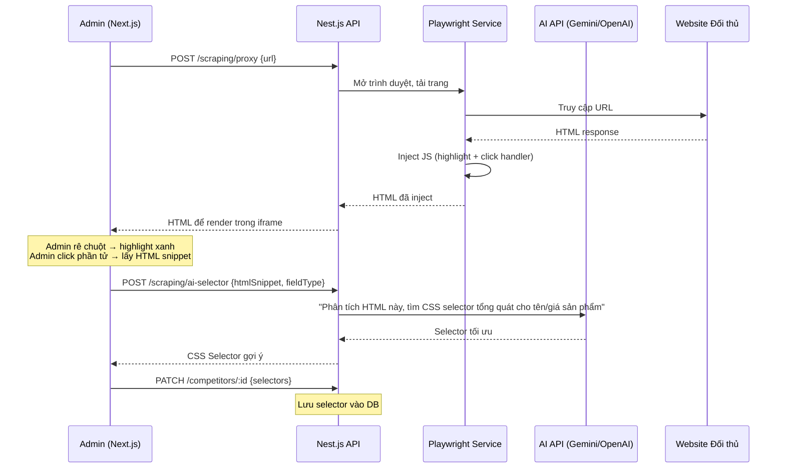

# Kế hoạch Triển khai Dự án AutoAP24h FullStack

## Mục tiêu

Xây dựng hệ thống quản lý & đối chiếu giá sản phẩm tự động giữa AP24h và các đối thủ cạnh tranh (CellphoneS, FPT, Hoàng Hà...), sử dụng kiến trúc **Fullstack Next.js (Frontend) + Nest.js (Backend)** với TypeScript. Hệ thống hỗ trợ cào dữ liệu tự động, so khớp sản phẩm, duyệt giá, và tự động cập nhật giá lên trang quản trị AP24h qua Playwright.

> [!IMPORTANT]
> Dự án này vừa là **công cụ thực tế** giải quyết bài toán kinh doanh, vừa là **bài tập thực hành** để nắm vững kiến trúc FullStack Next.js/Nest.js. Các công nghệ sẽ được cập nhật lên **phiên bản mới nhất** thay vì sử dụng các version cũ trong lesson 1 năm trước.

---

## 1. Stack Công nghệ

| Thành phần | Công nghệ | Ghi chú |
|---|---|---|
| **Frontend** | Next.js 15 (React 19, App Router) | TypeScript, TailwindCSS, Ant Design (antd) |
| **Backend** | Nest.js v11 | TypeScript, Module/Controller/Service pattern |
| **Database** | MongoDB (cài trực tiếp, không Docker) | Mongoose ODM, thiết kế linh hoạt |
| **Auth Frontend** | NextAuth (Auth.js v5) | Quản lý session, bảo vệ route |
| **Auth Backend** | JWT + Passport | Bearer Token, ConfigService cho `.env` |
| **Email** | Nodemailer + Handlebars | Template engine cho email HTML |
| **Scraping** | Playwright + Cheerio | Cào dữ liệu nhanh + Auto-update giá ổn định |
| **Scheduling** | CronJob (cơ bản) | Cào dữ liệu 1 lần/ngày |
| **Date/Time** | dayjs | Thay thế cho moment |

---

## 2. Thiết kế Database (MongoDB)

### 2.1. Collection `users` - Quản lý tài khoản nội bộ
```typescript
// User Schema
{
  _id: ObjectId,
  name: string,
  email: string,           // unique
  password: string,         // bcrypt hashed
  phone: string,            // bắt buộc, đồng bộ login với hệ thống công ty
  isActive: boolean,        // default: false, kích hoạt qua OTP email
  codeId: string,           // mã OTP (UUID ngẫu nhiên)
  codeExpired: Date,        // thời hạn OTP (5 phút)
  createdAt: Date,
  updatedAt: Date
}
```

### 2.2. Collection `competitors` - Cấu hình website đối thủ
```typescript
// Competitor Schema  
{
  _id: ObjectId,
  name: string,              // "CellphoneS", "FPT Shop"...
  domain: string,            // "cellphones.com.vn"
  logoUrl?: string,
  selectors: {
    productContainer: string, // CSS selector khối sản phẩm: ".product-info"
    productName: string,      // CSS selector tên: ".product__name"
    productPrice: string,     // CSS selector giá: ".product__price--show"
    loadMoreButton?: string,  // CSS selector nút "Xem thêm" (nếu có)
    pagination?: string       // CSS selector phân trang (nếu có)
  },
  isActive: boolean,
  createdAt: Date,
  updatedAt: Date
}
```

### 2.3. Collection `categories` - Danh mục sản phẩm
```typescript
// Category Schema
{
  _id: ObjectId,
  name: string,              // "iPad", "iPhone", "Mac", "Phụ kiện"
  slug: string,              // "ipad", "iphone"
  description?: string,
  isActive: boolean,
  createdAt: Date,
  updatedAt: Date
}
```

### 2.4. Collection `scraping_configs` - Cấu hình link cào theo danh mục
```typescript
// ScrapingConfig Schema
{
  _id: ObjectId,
  competitorId: ObjectId,     // ref -> competitors
  categoryId: ObjectId,       // ref -> categories
  url: string,                // "https://cellphones.com.vn/ipad.html"
  isActive: boolean,
  lastScrapedAt?: Date,
  createdAt: Date,
  updatedAt: Date
}
```

### 2.5. Collection `products` - Sản phẩm AP24h (nguồn chính)
```typescript
// Product Schema
{
  _id: ObjectId,
  name: string,
  normalizedName: string,     // tên đã chuẩn hóa (loại bỏ từ rác) để so khớp
  categoryId: ObjectId,       // ref -> categories
  currentPrice: number,       // giá hiện tại trên AP24h
  ap24hAdminUrl?: string,     // link trang sửa sản phẩm trên admin AP24h
  isActive: boolean,
  createdAt: Date,
  updatedAt: Date
}
```

### 2.6. Collection `competitor_products` - Sản phẩm cào từ đối thủ
```typescript
// CompetitorProduct Schema
{
  _id: ObjectId,
  competitorId: ObjectId,     // ref -> competitors
  scrapingConfigId: ObjectId, // ref -> scraping_configs
  name: string,
  normalizedName: string,
  price: number,
  scrapedAt: Date,            // thời điểm cào
  createdAt: Date,
  updatedAt: Date
}
```

### 2.7. Collection `product_matches` - Kết quả so khớp sản phẩm
```typescript
// ProductMatch Schema
{
  _id: ObjectId,
  productId: ObjectId,              // ref -> products (sản phẩm AP24h)
  competitorProductId: ObjectId,    // ref -> competitor_products
  matchScore: number,               // tỷ lệ khớp (0-1), threshold > 0.6
  ap24hPrice: number,
  competitorPrice: number,
  priceDifference: number,          // chênh lệch giá (VNĐ)
  priceDifferencePercent: number,   // chênh lệch giá (%)
  status: string,                   // "pending" | "approved" | "rejected" | "applied"
  approvedBy?: ObjectId,            // ref -> users
  approvedAt?: Date,
  appliedAt?: Date,                 // thời điểm đã cập nhật lên AP24h
  createdAt: Date,
  updatedAt: Date
}
```

### 2.8. Collection `price_histories` - Lịch sử thay đổi giá
```typescript
// PriceHistory Schema
{
  _id: ObjectId,
  productId: ObjectId,       // ref -> products
  oldPrice: number,
  newPrice: number,
  source: string,            // tên đối thủ (nguồn giá mới)
  changedBy: ObjectId,       // ref -> users (người duyệt)
  matchId: ObjectId,         // ref -> product_matches
  createdAt: Date
}
```

### 2.9. Collection `ignored_keywords` - Từ khóa loại trừ khi map
```typescript
// IgnoredKeyword Schema
{
  _id: ObjectId,
  keyword: string,           // "chính hãng", "apple", "2024", "wifi"...
  categoryId?: ObjectId,     // áp dụng cho danh mục cụ thể (null = tất cả)
  createdAt: Date
}
```

---

## 3. Kiến trúc Backend - Nest.js

### 3.1. Cấu trúc thư mục Backend
```
backend/
├── src/
│   ├── auth/                    # Module xác thực (JWT + Passport)
│   │   ├── auth.module.ts       # Đăng ký các service, strategy và cấu hình JWT
│   │   ├── auth.controller.ts   # Định nghĩa các endpoint (login, register, verify OTP)
│   │   ├── auth.service.ts      # Chứa logic nghiệp vụ xử lý đăng nhập, cấp token, gửi email
│   │   ├── dto/                 # Data Transfer Object (validate dữ liệu đầu vào)
│   │   │   ├── login.dto.ts     # Validate email/phone và password khi login
│   │   │   └── register.dto.ts  # Validate thông tin khi tạo tài khoản
│   │   └── passport/
│   │       └── jwt.strategy.ts  # Logic giải mã và verify JWT token từ header request
│   ├── users/                   # Module quản lý người dùng
│   │   ├── users.module.ts      # Khai báo module users
│   │   ├── users.controller.ts  # Endpoint CRUD nhân viên
│   │   ├── users.service.ts     # Thao tác với DB (tìm, thêm, sửa, xóa user)
│   │   ├── dto/                 # Các class DTO dùng cho tạo/cập nhật user
│   │   └── schemas/
│   │       └── user.schema.ts   # Định nghĩa cấu trúc document MongoDB cho User (Mongoose)
│   ├── competitors/             # Module quản lý đối thủ
│   │   ├── competitors.module.ts
│   │   ├── competitors.controller.ts # API CRUD đối thủ
│   │   ├── competitors.service.ts    # Logic lưu trữ thông tin & selector đối thủ
│   │   ├── dto/                 # DTO validate thông tin đối thủ
│   │   └── schemas/
│   │       └── competitor.schema.ts  # Cấu trúc DB lưu thông tin đối thủ và CSS selectors
│   ├── categories/              # Module quản lý danh mục sản phẩm
│   │   ├── categories.module.ts # Khai báo module categories
│   │   ├── categories.controller.ts # Định nghĩa các endpoint CRUD cho danh mục
│   │   ├── categories.service.ts    # Logic xử lý thêm, sửa, xóa danh mục
│   │   ├── dto/                 # Chứa các DTO validate thông tin danh mục
│   │   └── schemas/
│   │       └── category.schema.ts   # Cấu trúc DB MongoDB lưu danh mục sản phẩm
│   ├── products/                # Module quản lý sản phẩm gốc của AP24h
│   │   ├── products.module.ts   # Khai báo module products
│   │   ├── products.controller.ts   # Endpoint CRUD để lấy danh sách sản phẩm
│   │   ├── products.service.ts      # Logic lưu trữ, chuẩn hóa tên sản phẩm
│   │   ├── dto/                 # DTO validate thông tin sản phẩm
│   │   └── schemas/
│   │       └── product.schema.ts    # Cấu trúc DB MongoDB lưu sản phẩm AP24h
│   ├── scraping/                # Module cào dữ liệu (Playwright + Cheerio + CronJob)
│   │   ├── scraping.module.ts
│   │   ├── scraping.controller.ts # Endpoint kích hoạt cào thủ công, proxy, gợi ý AI
│   │   ├── scraping.service.ts  # Logic Playwright (tải trang), Cheerio (bóc tách) và gọi AI
│   │   └── scraping.cron.ts     # Khai báo CronJob (vd: @Cron('0 0 * * *')) chạy tự động
│   ├── matching/                # Module xử lý thuật toán so khớp sản phẩm
│   │   ├── matching.module.ts   # Khai báo module
│   │   ├── matching.controller.ts # Endpoint duyệt (Approve)/từ chối (Reject) giá
│   │   ├── matching.service.ts  # Logic so khớp token, tính % giống nhau
│   │   ├── dto/                 # DTO validate khi duyệt giá
│   │   └── schemas/
│   │       └── product_match.schema.ts # Cấu trúc DB lưu kết quả so khớp
│   ├── price-update/            # Module tự động cập nhật giá lên trang Admin AP24h
│   │   ├── price-update.module.ts # Khai báo module
│   │   ├── price-update.controller.ts # Endpoint nhận lệnh thực thi cập nhật giá
│   │   └── price-update.service.ts # Logic dùng Playwright giả lập thao tác Admin
│   ├── price-history/           # Module lưu trữ và truy vấn lịch sử giá
│   │   ├── price-history.module.ts # Khai báo module
│   │   ├── price-history.controller.ts # Endpoint truy xuất biểu đồ/danh sách lịch sử
│   │   ├── price-history.service.ts    # Logic ghi nhận thay đổi giá mới vào DB
│   │   └── schemas/
│   │       └── price_history.schema.ts # Cấu trúc DB MongoDB lưu lịch sử giá
│   ├── ignored-keywords/        # Module quản lý từ khóa rác (loại trừ khi map)
│   │   ├── ignored-keywords.module.ts # Khai báo module
│   │   ├── ignored-keywords.controller.ts # Endpoint CRUD danh sách từ khóa rác
│   │   ├── ignored-keywords.service.ts    # Logic phục vụ hàm chuẩn hóa tên sản phẩm
│   │   ├── dto/                 # DTO validate thêm/sửa từ khóa
│   │   └── schemas/
│   │       └── ignored_keyword.schema.ts  # Cấu trúc DB lưu từ khóa rác
│   ├── mail/                    # Module gửi email tự động (Nodemailer)
│   │   ├── templates/           # Thư mục chứa các file giao diện HTML của email (Handlebars)
│   │   │   ├── register.hbs         # Giao diện mail chứa mã OTP kích hoạt
│   │   │   ├── forgot-password.hbs  # Giao diện mail cấp lại mật khẩu
│   │   │   └── price-alert.hbs      # Giao diện cảnh báo có giá mới chờ duyệt
│   ├── app.module.ts            # Root module gom tất cả các module con, cấu hình Mongoose/Mail
│   └── main.ts                  # Điểm khởi chạy của server Nest.js, thiết lập ValidationPipe, CORS
├── .env                         # Khai báo biến môi trường (PORT, MongoDB URI, JWT Secret)
├── nest-cli.json                # File cấu hình Nest, chỉ định copy folder "templates" ra thư mục dist
├── package.json                 # Quản lý danh sách thư viện (dependencies)
└── tsconfig.json                # Cấu hình biên dịch TypeScript
```

### 3.2. Các Module Backend & API Endpoints

#### Auth Module (`/api/auth`)
| Method | Endpoint | Mô tả | Guard |
|---|---|---|---|
| POST | `/api/auth/register` | Đăng ký tài khoản + gửi OTP qua email | Public |
| POST | `/api/auth/login` | Đăng nhập, trả về JWT access_token | Public |
| POST | `/api/auth/verify` | Kích hoạt tài khoản bằng OTP | Public |
| POST | `/api/auth/retry-active` | Gửi lại mã kích hoạt | Public |
| POST | `/api/auth/forgot-password` | Gửi OTP quên mật khẩu | Public |
| POST | `/api/auth/reset-password` | Đổi mật khẩu bằng OTP | Public |

#### Users Module (`/api/users`)
| Method | Endpoint | Mô tả | Guard |
|---|---|---|---|
| GET | `/api/users` | Danh sách nhân viên | JWT |
| POST | `/api/users` | Thêm nhân viên mới | JWT |
| PATCH | `/api/users/:id` | Cập nhật thông tin | JWT |
| DELETE | `/api/users/:id` | Xóa nhân viên | JWT |

#### Competitors Module (`/api/competitors`)
| Method | Endpoint | Mô tả | Guard |
|---|---|---|---|
| GET | `/api/competitors` | Danh sách đối thủ | JWT |
| POST | `/api/competitors` | Thêm đối thủ mới | JWT |
| PATCH | `/api/competitors/:id` | Cập nhật cấu hình selector | JWT |
| DELETE | `/api/competitors/:id` | Xóa đối thủ | JWT |

#### Scraping Module (`/api/scraping`)
| Method | Endpoint | Mô tả | Guard |
|---|---|---|---|
| POST | `/api/scraping/proxy` | Proxy tải trang web về (cho UI Point & Click) | JWT |
| POST | `/api/scraping/ai-selector` | Gọi AI phân tích HTML → trả CSS selector | JWT |
| POST | `/api/scraping/ai-keywords` | Gọi AI phân tích danh sách SP mẫu → gợi ý từ khóa rác | JWT |
| POST | `/api/scraping/run` | Chạy thủ công một lượt cào | JWT |
| GET | `/api/scraping/status` | Trạng thái CronJob | JWT |

#### Matching Module (`/api/matching`)
| Method | Endpoint | Mô tả | Guard |
|---|---|---|---|
| GET | `/api/matching` | Danh sách kết quả so khớp (bảng đối chiếu giá) | JWT |
| POST | `/api/matching/approve` | Duyệt (Approve) cập nhật giá | JWT |
| POST | `/api/matching/reject` | Từ chối cập nhật giá | JWT |
| POST | `/api/matching/apply` | Thực thi cập nhật giá lên AP24h (Playwright) | JWT |

#### Price History Module (`/api/price-history`)
| Method | Endpoint | Mô tả | Guard |
|---|---|---|---|
| GET | `/api/price-history` | Xem lịch sử thay đổi giá | JWT |
| GET | `/api/price-history/:productId` | Lịch sử theo sản phẩm | JWT |

#### Ignored Keywords Module (`/api/ignored-keywords`)
| Method | Endpoint | Mô tả | Guard |
|---|---|---|---|
| GET | `/api/ignored-keywords` | Danh sách từ khóa loại trừ | JWT |
| POST | `/api/ignored-keywords` | Thêm từ khóa | JWT |
| DELETE | `/api/ignored-keywords/:id` | Xóa từ khóa | JWT |

---

## 4. Kiến trúc Frontend - Next.js

### 4.1. Cấu trúc thư mục Frontend
```
frontend/
├── src/
│   ├── app/                           # Sử dụng Next.js App Router (Routing dựa trên thư mục)
│   │   ├── (auth)/                    # Route group cho Auth (bỏ qua 'auth' trên URL, không cần đăng nhập)
│   │   │   ├── login/
│   │   │   │   └── page.tsx           # Trang Đăng nhập (UI form đăng nhập)
│   │   │   ├── register/
│   │   │   │   └── page.tsx           # Trang Đăng ký tài khoản
│   │   │   ├── verify/
│   │   │   │   └── page.tsx           # Trang nhập mã OTP xác thực
│   │   │   └── forgot-password/
│   │   │       └── page.tsx           # Trang quên mật khẩu
│   │   ├── (admin)/                   # Route group cho Admin (bỏ qua 'admin' trên URL, yêu cầu JWT)
│   │   │   ├── layout.tsx             # Layout chung cho Admin: bọc Sidebar (Menu) + Header (Avatar, Logout)
│   │   │   ├── dashboard/
│   │   │   │   └── page.tsx           # Trang chủ tổng quan (thống kê số liệu)
│   │   │   ├── price-comparison/
│   │   │   │   └── page.tsx           # Bảng so sánh & duyệt giá cập nhật
│   │   │   ├── competitors/
│   │   │   │   ├── page.tsx           # Trang danh sách đối thủ cạnh tranh
│   │   │   │   └── [id]/
│   │   │   │       └── setup/
│   │   │   │           └── page.tsx   # ⭐ Trang Point & Click: Render web đối thủ qua Iframe để chọn selector
│   │   │   ├── categories/
│   │   │   │   └── page.tsx           # Trang quản lý danh mục sản phẩm (CRUD)
│   │   │   ├── ignored-keywords/
│   │   │   │   └── page.tsx           # Trang cấu hình danh sách từ khóa rác
│   │   │   ├── price-history/
│   │   │   │   └── page.tsx           # Trang xem biểu đồ và lịch sử thay đổi giá
│   │   │   └── users/
│   │   │       └── page.tsx           # Trang quản lý danh sách tài khoản nhân viên
│   │   ├── layout.tsx                 # Root layout: Nơi bọc thẻ html, body, cấu hình font chữ và theme Ant Design
│   │   └── page.tsx                   # Trang Root (/) - Thường dùng để redirect thẳng vào /dashboard hoặc /login
│   ├── components/                    # Chứa tất cả các React Components
│   │   ├── ui/                        # Các component UI nhỏ dùng chung (nút bấm, input, thông báo)
│   │   ├── layout/                    # Các khối layout lớn (SidebarMenu.tsx, AdminHeader.tsx)
│   │   └── features/                  # Các component phức tạp gắn liền với một tính năng lớn
│   │       ├── SelectorPicker.tsx     # ⭐ Component chứa logic iframe, highlight element và postMessage
│   │       ├── PriceComparisonTable.tsx # Component bảng chứa logic merge data so khớp
│   │       └── PriceHistoryChart.tsx  # Component vẽ biểu đồ (dùng thư viện Recharts hoặc Chart.js)
│   ├── lib/                           # Chứa các file tiện ích cấu hình và thư viện
│   │   ├── api.ts                     # Fetch wrapper: tự động lấy JWT từ session gắn vào Header Authorization
│   │   ├── auth.ts                    # File cấu hình NextAuth provider (gọi lên NestJS)
│   │   └── mockData/                  # Chứa dữ liệu giả (Mock) phục vụ lập trình UI khi chưa có Backend
│   │       └── index.ts               # File định nghĩa và xuất (export) dữ liệu giả
│   ├── actions/                       # Nơi chứa Next.js Server Actions (Thao tác gọi API an toàn từ phía Server)
│   │   ├── auth.action.ts             # Các hàm gọi API liên quan xác thực (login, register, verify)
│   │   ├── scraping.action.ts         # Các hàm gọi API cào dữ liệu, AI selector, đối chiếu giá
│   │   └── admin.action.ts            # Các hàm gọi API lấy thống kê, CRUD danh mục, user
│   └── types/                         # Chứa các interface/type TypeScript định nghĩa kiểu dữ liệu thống nhất
│       ├── user.type.ts               # Định nghĩa interface IUser, Role
│       ├── competitor.type.ts         # Định nghĩa interface ICompetitor, ISelector
│       ├── product.type.ts            # Định nghĩa interface IProduct, ICategory
│       └── scraping.type.ts           # Định nghĩa cấu trúc kết quả cào, kết quả so khớp
├── auth.ts                            # NextAuth entry point (cấu hình chính yếu của Auth.js)
├── middleware.ts                       # Middleware chặn các route (admin) nếu người dùng chưa đăng nhập
├── .env.local                         # Biến môi trường Next.js (NEXT_PUBLIC_API_URL, NEXTAUTH_SECRET)
├── package.json
├── tailwind.config.ts                 # Cấu hình Tailwind CSS
└── tsconfig.json                      # Cấu hình TypeScript cho Frontend
```

### 4.2. Danh sách Màn hình Frontend

#### Nhóm Auth (Không cần đăng nhập)
1. **Đăng nhập** (`/login`) - Form đăng nhập (phone + password), gọi API `/auth/login`, lưu JWT
2. **Đăng ký** (`/register`) - Form tạo tài khoản (thêm trường phone), gọi API → nhận OTP qua email
3. **Xác thực OTP** (`/verify`) - Modal/Form nhập mã OTP
4. **Quên mật khẩu** (`/forgot-password`) - Form email → OTP → đổi mật khẩu

#### Nhóm Admin (Cần đăng nhập - JWT)
5. **Dashboard** (`/dashboard`) - Tổng quan: số sản phẩm, số lượt cào, số giá chờ duyệt
6. **Bảng đối chiếu giá** (`/price-comparison`) - Bảng Ant Design hiển thị tất cả kết quả so khớp giá. Có nút Approve/Reject từng dòng hoặc chọn nhiều dòng
7. **Quản lý Đối thủ** (`/competitors`) - CRUD đối thủ cạnh tranh
8. **⭐ Setup Selector** (`/competitors/:id/setup`) - Trang Point & Click: nhập URL → hiển thị web đối thủ (qua proxy) → click chọn phần tử → AI xác nhận selector
9. **Quản lý Danh mục** (`/categories`) - CRUD danh mục sản phẩm
10. **Cấu hình Từ khóa** (`/ignored-keywords`) - Thêm/xóa từ khóa loại trừ khi map tên sản phẩm
11. **Lịch sử giá** (`/price-history`) - Bảng + biểu đồ lịch sử thay đổi giá theo thời gian
12. **Quản lý nhân viên** (`/users`) - CRUD tài khoản nội bộ (Thêm/Sửa/Xóa)

---

## 5. Tính năng ⭐ Point & Click Selector (Chi tiết)

Đây là tính năng nổi bật nhất - cho phép Admin cấu hình selector cào dữ liệu trực quan, không cần code.

### 5.1. Luồng hoạt động



### 5.2. Chi tiết kỹ thuật

1. **Proxy Service (Backend):** Playwright tải trang → scroll hết trang (lazy load) → inject đoạn JS custom:
   - Highlight khung xanh khi hover phần tử
   - Bắt sự kiện click → `postMessage` gửi thông tin HTML element về parent (Next.js iframe)
   - Vô hiệu hóa tất cả link gốc (ngăn điều hướng)

2. **AI Selector Analysis (Backend):** Nhận đoạn HTML xung quanh phần tử được click → gửi cho AI API:
   - Prompt: "Dựa trên đoạn HTML này, tìm CSS selector tổng quát nhất để lấy được TẤT CẢ các phần tử tương tự trên trang (tên sản phẩm/giá). Trả về selector class-based, tránh dùng nth-child."
   - AI trả về selector chuẩn + độ tin cậy

3. **Preview & Confirm (Frontend):** Sau khi có selector → Backend test thử selector trên trang → trả về số lượng kết quả khớp → Admin xác nhận lưu vào DB

### 5.3. Tính năng ⭐ AI Auto-Detect Ignored Keywords
Thay vì yêu cầu Admin tự phân tích và nhập thủ công các từ khóa rác (như "Chính hãng", "VN/A") khi thiết lập một đối thủ mới, hệ thống sẽ sử dụng AI để tự động đề xuất.

**Luồng hoạt động:**
1. Khi cào thử thành công 1 trang của đối thủ, Backend lấy ra danh sách 10-20 tên sản phẩm mẫu.
2. Backend gửi danh sách này cùng danh sách sản phẩm mẫu của AP24h cho AI API (Gemini/OpenAI).
3. **Prompt:** "So sánh 2 danh sách tên sản phẩm sau. Hãy tìm ra các từ khóa mang tính chất marketing, phiên bản, hoặc rác (ví dụ: 'chính hãng', 'mới', 'apple') mà bên đối thủ có nhưng bên AP24h không có. Trả về mảng các từ khóa cần loại bỏ."
4. UI hiển thị danh sách từ khóa do AI đề xuất. Admin có thể xem xét, tick chọn, sửa hoặc xóa trước khi bấm **Lưu vào Ignored Keywords**.

---

## 6. Luồng Xác thực JWT

### 6.1. Cấu hình Backend (Nest.js)
- Cài đặt `@nestjs/jwt`, `@nestjs/passport`, `passport-jwt`
- Tạo `JwtStrategy` trong thư mục `passport/`
- Khai báo JWT Module tại `AuthModule` với `registerAsync` + `ConfigService`:
  - `JWT_SECRET` từ file `.env` (UUID ngẫu nhiên)
  - `JWT_ACCESS_TOKEN_EXPIRE` từ `.env` (VD: "1d")
- Khai báo `JwtAuthGuard` Global để bảo vệ tất cả endpoint (trừ @Public)
- Sử dụng `bcrypt` để hash password và compare

### 6.2. Cấu hình Frontend (Next.js)
- Cài đặt `next-auth` phiên bản mới nhất (Auth.js v5)
- Tạo `CredentialsProvider` gọi API `/auth/login` của Nest.js
- Lưu `access_token` vào session NextAuth
- `middleware.ts` bảo vệ tất cả route `/admin/*`
- Custom fetch wrapper: tự động gắn `Authorization: Bearer <token>` vào mọi request

### 6.3. Luồng Authentication

```mermaid
flowchart TD
    A[User mở app] --> B{Đã đăng nhập?}
    B -->|Chưa| C[/login]
    B -->|Rồi| D[/dashboard]
    C --> E[Nhập phone + password]
    E --> F[Next.js gọi Nest.js /auth/login]
    F --> G{Tài khoản active?}
    G -->|Chưa| H[Hiện form nhập OTP / Gửi lại OTP]
    G -->|Rồi| I[Nest.js trả JWT access_token]
    I --> J[NextAuth lưu token vào session]
    J --> D
    H --> K[User nhập OTP]
    K --> L[Gọi /auth/verify]
    L --> C
```

---

## 7. Gửi Email Template

### 7.1. Cấu hình
- Cài đặt `@nestjs-modules/mailer`, `nodemailer`, `handlebars`
- Cấu hình SMTP Gmail trong `AppModule`:
  - `MAIL_HOST`: `smtp.gmail.com`
  - `MAIL_PORT`: `465`
  - `MAIL_USER` / `MAIL_PASSWORD`: Google App Password (bắt buộc bật 2FA)
- Cấu hình `nest-cli.json`: thêm `compilerOptions.assets` để copy thư mục template `.hbs` sang `dist/`

### 7.2. Template Email
- `register.hbs`: Email kích hoạt tài khoản (chứa OTP code, hết hạn 5 phút)
- `forgot-password.hbs`: Email đổi mật khẩu (chứa OTP code)
- `price-alert.hbs`: Thông báo có giá mới cần duyệt (tùy chọn)

---

## 8. Lộ trình Triển khai (Fullstack Đồng Thời)

> [!TIP]
> Phương pháp tiếp cận: **Triển khai Fullstack theo từng tính năng (Feature-based)**. Thay vì code toàn bộ Backend rồi mới làm Frontend hoặc dùng Mock Data, chúng ta sẽ xây dựng song song: code API xong sẽ tích hợp ngay lên UI.

### Phase 1: Khởi tạo dự án & Nền tảng (Đã hoàn thành)
- [x] Khởi tạo Frontend (Next.js 15) & Backend (Nest.js 11).
- [x] Thiết lập MongoDB, biến môi trường (`.env`).
- [x] Cấu hình Global Backend (ValidationPipe, ExceptionFilter, CORS).
- [x] Xây dựng UI tĩnh cho Admin Layout (Sidebar, Header, Responsive).

### Phase 2: Xác thực Người dùng (Auth & Users) (Đã hoàn thành)
- **Backend:** 
  - [x] Tạo Schema & Module Users, thao tác CRUD cơ bản.
  - [x] Mã hóa mật khẩu bằng `bcrypt`.
  - [x] Tích hợp JWT, Passport (`JwtStrategy`), `JwtAuthGuard`.
  - [x] Thiết lập Nodemailer và gửi Email OTP.
  - [x] Xây dựng API Register, Login, Verify OTP, Forgot Password, Reset Password.
- **Frontend:**
  - [x] Dựng UI các trang Login, Register, Verify OTP, Forgot Password, Reset Password.
  - [x] Viết Server Actions gọi API thật (`fetch`) xuống Backend.
  - [x] Lưu trữ JWT Token vào Cookie (`next/headers`) an toàn.
  - [x] Tích hợp 100% Frontend - Backend luồng đăng nhập và cấp lại mật khẩu.

### Phase 3: Quản lý Danh mục & Đối thủ (CRUD cơ bản)
- **Backend:**
  - [ ] Dùng Nest CLI tạo module, controller, service cho Categories và Competitors.
  - [ ] Định nghĩa Schema Category (`name`, `slug`, `isActive`).
  - [ ] Định nghĩa Schema Competitor (`name`, `domain`, `selectors` cho CSS).
  - [ ] Cung cấp API CRUD (GET, POST, PATCH, DELETE) cho 2 module trên.
- **Frontend:**
  - [ ] Dựng UI trang Quản lý Danh mục (`/categories`) bằng Ant Design Table.
  - [ ] Dựng UI trang Quản lý Đối thủ (`/competitors`) bằng Ant Design Table.
  - [ ] Xây dựng Modal Form (Thêm/Sửa) trực tiếp trên trang.
  - [ ] Viết Server Actions gọi API CRUD (revalidateTag để update data).
  - [ ] Tích hợp tính năng Thêm/Sửa/Xóa trực tiếp lên UI.

### Phase 4: Core Scraping & Point & Click (Tích hợp AI & Playwright)
- **Backend:**
  - [ ] Cài đặt `playwright` và `cheerio`.
  - [ ] Viết API `POST /scraping/proxy` sử dụng Playwright tải web đối thủ, vô hiệu hóa link và inject JS.
  - [ ] Viết API `POST /scraping/ai-selector` kết nối Gemini/OpenAI phân tích HTML snippet.
- **Frontend:**
  - [ ] Xây dựng màn hình Setup Selector (`/competitors/:id/setup`).
  - [ ] Tích hợp Iframe hiển thị web đối thủ qua Proxy API.
  - [ ] Xử lý sự kiện click & highlight phần tử trong Iframe (postMessage).
  - [ ] Gửi HTML snippet lên Backend nhờ AI gợi ý selector.
  - [ ] Admin xác nhận và lưu CSS Selector vào cấu hình đối thủ.

### Phase 5: Thuật toán So khớp & Cập nhật Giá (Matching & Auto-Update)
- **Backend:**
  - [ ] Viết thuật toán chuẩn hóa tên SP (loại bỏ từ khóa rác) và Token Matching (so khớp tỷ lệ >= 60%).
  - [ ] Cấu hình Cronjob (`@nestjs/schedule`) chạy tự động cào giá định kỳ theo ngày.
  - [ ] Lưu kết quả so khớp vào bảng `product_matches`.
  - [ ] Viết API lấy kết quả so khớp, Approve/Reject giá.
  - [ ] Dùng Playwright giả lập Admin (lưu session) thao tác cập nhật giá tự động lên website AP24h khi có lệnh Approve.
- **Frontend:**
  - [ ] Xây dựng Bảng đối chiếu giá (`/price-comparison`).
  - [ ] Hiển thị thông tin So sánh (Giá AP24h vs Giá Đối thủ, % Chênh lệch, Trạng thái).
  - [ ] Gắn API cho phép Admin click nút Duyệt/Từ chối (Approve/Reject).

### Phase 6: Thống kê & Polish (Dashboard & Price History)
- **Backend:**
  - [ ] Viết API tổng hợp số liệu thống kê (tổng sản phẩm, tổng từ khóa, đối thủ).
  - [ ] Thiết kế bảng `price_histories` ghi nhận mọi thay đổi giá.
  - [ ] API truy xuất Lịch sử giá (`/price-history`).
- **Frontend:**
  - [ ] Cập nhật Dashboard: Render số liệu thật và vẽ biểu đồ (Chart.js / Recharts).
  - [ ] Xây dựng UI trang Lịch sử giá (Table + Biểu đồ đường thay đổi giá).
  - [ ] Kiểm thử End-to-End toàn bộ hệ thống (Login -> Cào dữ liệu -> Duyệt giá).
  - [ ] Polish UX/UI (thêm Loading Spinners, Error Toasts, Empty states).

---

## 9. Cấu hình Môi trường (.env)

### Backend `.env`
```env
# Database
MONGODB_URI=mongodb://localhost:27017/autoap24h

# Server
PORT=3001

# JWT
JWT_SECRET=<uuid-random>
JWT_ACCESS_TOKEN_EXPIRE=1d

# Email (Gmail SMTP)
MAIL_HOST=smtp.gmail.com
MAIL_PORT=465
MAIL_USER=your-email@gmail.com
MAIL_PASSWORD=<google-app-password-16-chars>
MAIL_FROM="AutoAP24h <your-email@gmail.com>"

# AI API (cho tính năng selector)
AI_API_KEY=<gemini-or-openai-api-key>

# AP24h Admin (cho Playwright auto-update)
AP24H_ADMIN_URL=https://ap24h.vn/admin
```

### Frontend `.env.local`
```env
# Backend API
NEXT_PUBLIC_API_URL=http://localhost:3001

# Chế độ gọi API (Hiện tại đã loại bỏ Mock Data hoàn toàn)
NEXT_PUBLIC_USE_MOCK_DATA=false
```

---

## 10. Kế hoạch Xác minh (Verification Plan)

### Automated Tests
```bash
# Backend
cd backend && npm run test          # Unit tests (Nest.js)
cd backend && npm run test:e2e      # E2E tests

# Frontend
cd frontend && npm run build        # Kiểm tra build thành công
```

### Manual Verification
- [x] Đăng ký tài khoản → nhận OTP email → kích hoạt → đăng nhập thành công
- [ ] CRUD đối thủ + setup selector bằng Point & Click
- [ ] Chạy cào thủ công → xem kết quả so khớp trên bảng đối chiếu giá
- [ ] Approve giá → Playwright tự động cập nhật lên AP24h admin
- [ ] Kiểm tra lịch sử giá sau khi cập nhật
- [x] Quên mật khẩu → nhận OTP → đổi mật khẩu mới → đăng nhập lại

---

> [!NOTE]
> **Cách làm việc:** Bạn sẽ tự tay code theo hướng Fullstack - xây dựng API ở Backend, ngay sau đó móc API đó lên Frontend qua Server Actions. Quá trình học tập sẽ rất sát với dự án thực tế.
